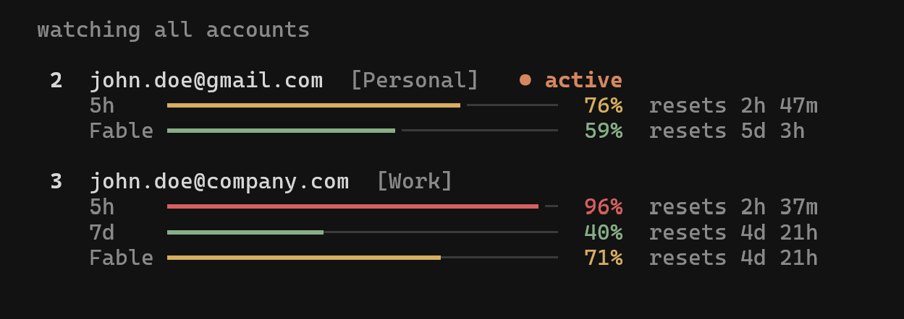

# ccswap (Claude Codex Swap)

Multi-account and usage manager for Claude Code and OpenAI Codex. Save multiple logins, check their quota windows, switch manually or automatically before you hit a rate limit, and manage both providers from one dashboard.

`ccswap` began as a fork of [claude-swap (`cswap`)](https://github.com/realiti4/claude-swap) by Onur Cetinkol, and still carries the original MIT license and credit for that. Since then it's grown into its own project: no more tracking upstream, no `cswap` compatibility, its own package and release line, and adds Codex support. It's MIT-licensed too, so fork it, file issues, send PRs — whatever's useful to you.

## Installation

### Using uv (recommended)

```bash
uv tool install ccswap
```

### Using pipx

```bash
pipx install ccswap
```

### From source

```bash
git clone https://github.com/errhythm/cc-swap.git
cd cc-swap
uv sync
uv run ccswap help
```

### Updating

```bash
ccswap upgrade          # uv/pipx installs on macOS/Linux: auto-detects and upgrades
# or run your installer directly:
uv tool upgrade ccswap
pipx upgrade ccswap
```

## Usage

### Add your first account

Log into Claude Code with your first account, then:

```bash
ccswap add
```

### Add more accounts

Log in with another account, then:

```bash
ccswap add
```

### Switch accounts

Rotate to the next account:

```bash
ccswap switch
```

Or switch to a specific account:

```bash
ccswap switch 2
ccswap switch user@example.com
ccswap switch dev                # or by alias, once set with `ccswap alias 2 dev`
```

Not sure which one? `ccswap list` is the dashboard — every account's 5-hour and 7-day usage and reset times at a glance:

```bash
ccswap list
```

Or ccswap auto-picks by remaining quota — `ccswap switch --strategy best` (most quota left) or `--strategy next-available` (skip rate-limited accounts).

**Note:** You usually don't need to restart — on Linux/Windows the new account is picked up automatically, and on macOS after the Keychain cache expires. To apply it instantly, restart Claude Code or reopen the VS Code extension tab. See [Tips](#tips) for the per-platform details.

### Automatic switching

Let ccswap watch your usage and switch for you. When the active account's 5-hour or 7-day window reaches the threshold (default 90%), it switches to the account with the most quota left — before you hit the limit, and safe to run while Claude Code is working:

```bash
ccswap auto                     # foreground loop, polls every 60s
ccswap auto --threshold 80      # switch earlier
ccswap auto --model Fable       # also switch when the Fable weekly limit is hit
ccswap auto --once              # single check-and-switch, for cron/scripts
ccswap auto --dry-run           # log what it would do, never switch
```

<details>
<summary>How it behaves & advanced usage</summary>

- Runs safely alongside Claude Code: switches take the same credential locks Claude Code uses, so a swap never collides with a token refresh.
- A cooldown (default 5 min) and a hysteresis margin stop it flip-flopping near the threshold: a proactive switch only lands on an account that's below the threshold *and* better than the current one by the margin — a candidate that clears the margin is always taken, but two accounts hovering at the line never ping-pong. When every account is exhausted it sleeps until the first one becomes usable again.
- Usage polling is adaptive — a couple of accounts per check, busy alternates watched more closely, exhausted ones left alone until they reset — so API traffic stays flat no matter how many accounts you manage.
- It fails safe: if a usage check errors it keeps trusting the last-known numbers while retries back off, and an expired token on an idle machine makes it hold rather than fail over (Claude Code refreshes the token on your next message).
- An account whose refresh token has died is quarantined and reported until you either log in with it and re-run `ccswap add --slot N`, or replace its stored credentials from a known-good export with `ccswap import backup.cswap --force`. API-key accounts are never rotated onto unless you pass `--include-api-key-accounts`.
- To hold an account out of rotation yourself — a work account you don't want touched, one you're resting — run `ccswap disable <num|email>`; `ccswap enable <num|email>` puts it back. Disabled accounts are skipped by auto-switch, bare `ccswap switch`, and the `best` / `next-available` strategies, but stay fully managed and remain a valid explicit `ccswap switch <num|email>` target. They show a `(disabled)` marker in `ccswap list`, in the [TUI](#interactive-dashboard-tui), and in the [menu bar](#menu-bar-macos) — both of which also let you toggle the state in place (TUI: menu → *Disable / enable account…*; menu bar: *Disable / enable account*).
- By default only the account-wide 5h/7d windows drive switching. If you work on one model and hit its **weekly per-model limit** first (e.g. Fable), add `--model Fable` (or `cswap config set autoswitch.model Fable`) to fold that model's window into the decision, so it switches off an account whose model quota is spent even while its 5h/7d windows still have room.
  - **Model names** are Anthropic's own per-model `display_name`s, matched case-insensitively. The exact strings for your accounts are the per-model rows in `ccswap list` (e.g. a line reading `Fable: 100%`).

For cron/systemd timers, `--once` reports the outcome in its exit code (`0` switched, `1` error, `2` nothing to do, `3` blocked — no viable target), and `--json` emits one JSON event per line:

```bash
*/5 * * * * ccswap auto --once --json >> ~/.ccswap-auto.log 2>&1
```

Defaults like the threshold and cooldown are configurable with `ccswap config set autoswitch.threshold 80` — flags override them (see [Configuration](#configuration)).

</details>

### Run multiple accounts at the same time (session mode)

Launch Claude Code as a specific account in the current terminal only — every other terminal and the VS Code extension stay on your default account, so two accounts can work in parallel.

```bash
ccswap run 2                     # launch Claude Code as account 2, here only
ccswap run user@example.com      # by email
ccswap run 2 -- --resume         # everything after '--' is forwarded to claude
ccswap run 2 --share-history     # share your chat history with this account too
```

Sessions use your normal `~/.claude` setup (settings, CLAUDE.md, skills, MCP servers, etc.), but each account keeps its own chat history — pass `--share-history` if you want your accounts to continue the same conversations.

<details>
<summary>Sharing details — MCP servers & chat history</summary>

- With `--share-history`, a session started under one account shows up in `--resume` under the others, and nothing already saved is lost.
- User-scope MCP servers (`claude mcp add -s user`) are mirrored from your default profile on every launch — manage them there; changes made inside a session don't persist. Definitions are copied as-is (including inline `env`/`headers` values), but MCP OAuth logins are not — HTTP servers may ask you to authenticate once per profile via `/mcp`.
- `--no-share` turns sharing off and removes the mirrored MCP config (profiles that never mirrored are left alone).

</details>

<details>
<summary>Map accounts to directories — auto-pick per repo</summary>

Bind a directory to an account, and a bare `cswap run` there launches that account in session mode — e.g. work account in work repos, personal elsewhere:

```bash
cswap map 2 ~/work/client-app   # map a directory to account 2
cswap map user@example.com      # map the current directory
cswap map                       # list mappings
cswap unmap ~/work/client-app   # remove one (defaults to current directory)

cd ~/work/client-app/src
cswap run                       # → account 2, session mode
```

Subfolders inherit the nearest mapped ancestor. In an unmapped directory, `cswap run` just launches plain `claude` with your default login. Mappings are per-machine (not part of `cswap export`) and are cleaned up when their account is removed.

</details>

### Interactive dashboard (TUI)

Run `ccswap` on its own (or `ccswap tui`) for the full-screen dashboard: live usage, switching, and auto-switching for Claude Code and Codex, all keyboard-driven. Use **Provider: Claude Code…** in the menu to change providers. Arrow-key and Vim-style menu navigation wraps at both ends. `ccswap watch` opens straight into the live monitor. Works on macOS, Linux, and Windows.



### Codex accounts

`ccswap` can also save and switch Codex CLI logins. Log into each account with `codex login`, then save it before logging into the next one:

```bash
codex login
ccswap codex add

# Log in to the next Codex account, then save it too.
codex login
ccswap codex add

ccswap codex list
ccswap codex usage                # fetch 5h/7d windows; prints diagnostic errors
ccswap codex switch 1
ccswap codex switch                 # rotate to the next saved account
ccswap codex auto --once            # switch when active quota reaches the threshold
ccswap codex remove 2
```

Codex switching preserves the rest of `CODEX_HOME` (configuration, skills, sessions, and history) and replaces only `auth.json`. Restart Codex after switching so its running process loads the selected login. For ChatGPT-backed file logins, the dashboard reads the same read-only Codex rate-limit endpoint used by Codex and shows its primary (5h) and secondary (7d) windows. API-key accounts have no ChatGPT subscription quota, so they remain status-only. `ccswap codex auto` uses the same threshold, cooldown, `--once`, `--dry-run`, and JSON event controls as Claude auto-switching; it prepares the account for the next Codex launch and reports when a restart is needed.

Codex must use its documented file credential store. If your `~/.codex/config.toml` says `cli_auth_credentials_store = "keyring"`, change it to `"file"`, run `codex login`, then add the account. This deliberate restriction avoids writing a guessed OS-keyring entry.


### Refresh expired tokens

If an account's token expires, log back into Claude Code with that account and re-run:

```bash
ccswap add
```

This will update the stored credentials without creating a duplicate.

### Other commands

```bash
ccswap run 2                     # Run an account in this terminal only (session mode)
ccswap auto                      # Auto-switch when nearing rate limits (see above)
ccswap codex list                # List saved Codex CLI accounts
ccswap codex switch 2            # Switch the file-backed Codex login
ccswap config                    # Show or edit settings (see Configuration below)
ccswap list                      # Show all accounts with 5h/7d usage and reset times
ccswap status                    # Show current account
ccswap add --slot 3              # Add account to a specific slot (prompts before overwrite)
ccswap add --alias dev           # Add account and give it a short alias
ccswap remove 2                  # Remove an account
ccswap disable 2                 # Hold an account out of auto-rotation (keeps its login)
ccswap enable 2                  # Return a disabled account to rotation
ccswap alias 2 dev               # Give an account a short alias (usable anywhere NUM|EMAIL is)
ccswap alias 2 --unset           # Remove an account's alias
ccswap alias                     # List all aliases
ccswap tui                       # Interactive dashboard (also: bare `ccswap`)
ccswap watch                     # Dashboard, opened on the live watch page
ccswap upgrade                   # Upgrade ccswap to the latest version
ccswap purge                     # Remove all ccswap data
```

The legacy `cswap` command remains available as a compatibility alias; use `ccswap` for new scripts.

## Tips

- **Do you need to restart after switching?** Usually not. On **Linux and Windows**, credentials are stored in a file and Claude Code re-reads them whenever that file changes, so the new account takes effect on your next message — no restart needed. On **macOS**, credentials live in the Keychain, which Claude Code caches for about 30 seconds; a running session picks up the switch once that cache expires. Restart Claude Code (or close and reopen the VS Code extension tab) only if you want the change to apply instantly.
- **Continuing sessions after switching:** You can keep using the same Claude Code session after switching — run `ccswap switch` in any terminal and carry on. If you'd prefer a clean start, close and reopen Claude Code (or the VS Code extension tab) and use `--resume` to pick your previous session. Either way, the first message on the new account may use extra usage as its conversation cache rebuilds.

## How it works

- Backs up provider credentials when you add an account
- Swaps Claude Code credentials or Codex's file-backed `auth.json` when you switch
- Account credentials stored securely using platform-appropriate methods
- Switches (manual and automatic) hold Claude Code's own credential locks while writing, so a swap never interleaves with a token refresh
- Auto-switch freshens a target's token before activating it, and quarantines accounts whose refresh token has died (recover by re-adding it with `ccswap add --slot N`, or by replacing its stored credentials from a known-good export with `ccswap import backup.cswap --force`)
- Usage numbers refresh every few minutes — faster for an account being used or close to switching, slower for idle ones — keeping ccswap comfortably inside Anthropic's rate limits however many dashboards you keep open on a machine. An age note like `· 6m ago` just means the next scheduled check hasn't come yet, not that something is stuck.
- Codex usage checks refresh inactive saved logins when possible; running Codex sessions must be restarted after a Codex account switch

## Data locations

| Platform | Credentials | Config backups |
|----------|-------------|----------------|
| Windows | File-based (inside the backup directory, under `credentials/`) | `~/.claude-swap-backup/` |
| macOS | macOS Keychain | `~/.claude-swap-backup/` |
| Linux / WSL | File-based (inside the backup directory, under `credentials/`) | `${XDG_DATA_HOME:-~/.local/share}/claude-swap/` |

Session-mode profiles (`ccswap run`) live under the backup directory in `sessions/`. Tool preferences (`settings.json`) and auto-switch state (`autoswitch_state.json` — cooldown and quarantined accounts; delete it to reset) live in the backup directory root.

On Linux/WSL, set `XDG_DATA_HOME` to override the default location.

## Menu bar (macOS)

<details>
<summary>Optional macOS menu bar app — usage at a glance, click to switch</summary>

Needs the `menubar` extra (macOS only):

```bash
uv tool install 'ccswap[menubar]'   # or: pipx install 'ccswap[menubar]'
ccswap menubar
```

Shows every account's 5h / 7d / spend usage and switches with a click (specific / rotate / best / next-available), plus the TUI's add / disable-enable / remove / refresh actions. Enable *Settings → Auto-switch accounts* to run the same engine as [`ccswap auto`](#automatic-switching) in the background; it shares the `autoswitch.*` settings, so the menu bar and CLI stay in sync. Off until you turn it on.

</details>

## Advanced

### Configuration

Tool preferences live in `settings.json` in the backup root; `ccswap config` reads and edits it with validation, so you never have to find the file or guess valid ranges.

<details>
<summary>Commands & usage</summary>

```bash
ccswap config                              # list effective settings ("(default)" = not set)
ccswap config get autoswitch.threshold
ccswap config set autoswitch.threshold 80  # validated: rejects out-of-range values loudly
ccswap config set autoswitch.model Fable   # per-model switching (see "auto"); Fable,Opus for several
ccswap config unset autoswitch.threshold   # back to the default
ccswap config path                         # where settings.json lives
```

`ccswap config --help` lists every key with its valid range and default. Hand-editing the file still works — `ccswap config` is just a safer front door. `list` and `get` take `--json` for scripting.

</details>

### Backup and migration

Move account data between machines or back it up:

```bash
ccswap export backup.cswap                    # All accounts to a file
ccswap export backup.cswap --account 2        # One account
ccswap export backup.cswap --full             # Include full local ~/.claude.json (same-PC backup)
ccswap import backup.cswap                    # Skips accounts that already exist
ccswap import backup.cswap --force            # Overwrite existing
```

The export file is plaintext JSON. If you need encryption, pipe through your tool of choice (e.g. `ccswap export - | gpg -c > backup.gpg`).

If an imported account is the one you're currently logged in as, activate the imported credentials with `ccswap switch N --force` (a plain `switch` to the current account is a safe no-op and won't touch the import).

### JSON output for scripting

Add `--json` to `list`, `status`, or `switch` to emit a single machine-readable JSON object on stdout (human-readable notices go to stderr). Useful for scripting auto-swap and quota tracking.

```bash
ccswap list --json                   # all accounts with usage/quota
ccswap status --json                 # current active account
ccswap switch --strategy best --json # switch, then report the result
ccswap switch 2 --json
```

<details>
<summary>Example output & schema notes</summary>

```json
{
  "schemaVersion": 1,
  "activeAccountNumber": 2,
  "accounts": [
    { "number": 2, "email": "you@example.com", "active": true, "usageStatus": "ok",
      "usage": { "fiveHour": { "pct": 25.0, "resetsAt": "2026-06-22T23:29:59Z" },
                 "sevenDay": { "pct": 16.0, "resetsAt": "2026-06-26T17:59:59Z" } } }
  ]
}
```

Every payload carries a `schemaVersion` (currently `1`); on a handled error stdout is `{"schemaVersion":1,"error":{...}}` with a non-zero exit code. `--switch`/`--switch-to` report `{"switched": true|false, "from": …, "to": …, "reason": …}`.

Usage is served from a per-account cache: when the usage API is briefly unreachable, the last-known numbers are shown instead of nothing (the human view marks them with their age, e.g. `· 2m ago`). Rows with usage carry additive `usageFetchedAt`/`usageAgeSeconds` fields telling you how old the measurement is. An account held out of rotation with `cswap disable` carries an additive `"disabled": true` on its row (absent otherwise).

An account row also carries an additive `alias` field once one is set with `cswap alias` (e.g. `"alias": "dev"`); accounts without one simply omit the key.

</details>

`ccswap auto --json` emits an event *stream* instead — one JSON object per line (`{"schemaVersion":1,"event":"switch","ts":…, …}` with kinds like `poll`, `switch`, `no-switch`, `account-quarantined`, `all-exhausted`, `error`). The contract is additive: new kinds and fields may appear, so scripts should ignore unknown ones.

### Add an account from a raw token or API key

If you only have a long-lived setup-token (e.g., produced by `claude setup-token`)
or a managed API key (`sk-ant-api...`) and you don't want to log in via the browser
flow first — useful on headless servers or when receiving a token from another
machine — register it directly. The token type is auto-detected:

```bash
ccswap add-token sk-ant-oat01-...             # OAuth setup-token
ccswap add-token sk-ant-api03-...             # managed API key
ccswap add-token sk-ant-oat01-... --slot 3
ccswap add-token - --slot 3                   # read token from stdin
ccswap add-token --email user@example.com     # optional label override
```

`--email` is optional; omitted values use `setup-token-{slot}@token.local`
(or `api-key-{slot}@token.local` for API keys). No Anthropic API calls are made.

**API-key accounts.** An `sk-ant-api...` value registers a managed API-key account
(the kind Claude Code uses after `/login` with a key) rather than an OAuth
setup-token. It switches like any other account; since API keys have no subscription
quota, they show no usage and the usage-aware `switch` strategies never skip them as
rate-limited.

## Uninstall

Remove all data:

```bash
ccswap purge
```

Then uninstall the tool:

```bash
uv tool uninstall ccswap
# or
pipx uninstall ccswap
```

## Requirements

- Python 3.12+
- Claude Code and/or Codex CLI
- A file-backed login for managed Codex accounts

## License

MIT. This fork retains the original project's copyright and license notice; see [LICENSE](LICENSE). Upstream: [realiti4/claude-swap](https://github.com/realiti4/claude-swap).
